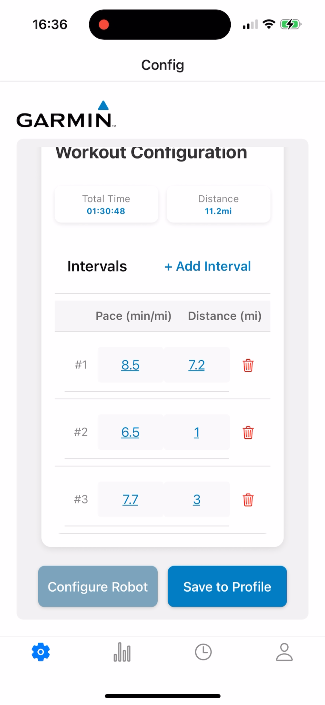
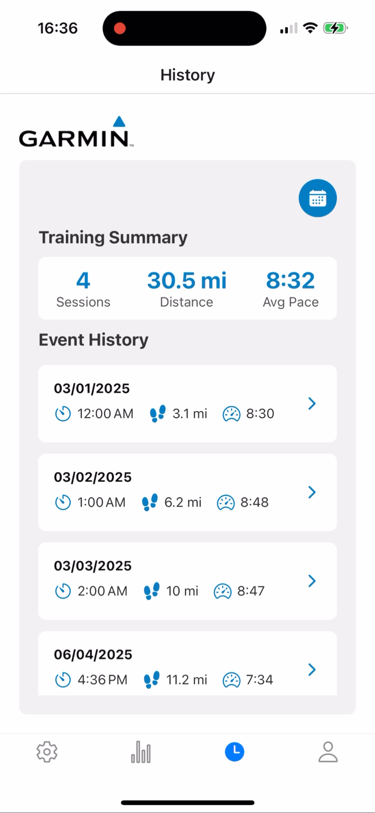

# RoboRacer Software

## Project Overview
RoboRacer is a robot designed to pace a runner. It *should* drive at a certain speed that is configured by the user while autonomously following a line around a standard 400 meter track. This project was developed by an Oregon State University Interdisciplinary Capstone team during the 2024-25 academic year. 

RoboRacer is comprised of two main components: hardware and software.
 1. **Hardware**: The physical robot itself. E.g. chassis, motors, wheels, sensors, processors, displays, etc.
2. **Software**: The programs used to configure and control the robot. There are two distinct software projects that work together to configure and control the robot: the **Embedded Program** and the **Mobile App**.
    1. **Embedded Program**: C/C++ code that executes on the robot's processor, controls speed and navigation. 
    2. **Mobile App**: React Native mobile application that provides an interface to configure the robot.

## Embedded Program
C/C++ code that executes on the robot's processor. Using input from the mobile app (for initial configuration) and on-board sensors, it computes how to adjust its navigation and speed so that the robot drives the correct speed and continues tracking over the top of a line.

See embedded program repo (submodule) for detailed documentation.

## Mobile App
React Native mobile application that provides an interface to configure the robot. Connects to the embedded program via Bluetooth to transmit configuration data (speeds, time intervals).

    
    
    
    

See mobile app repo (submodule) for detailed documentation. 

## (Theoretical) Usage Instructions
1. Turn on robot and open mobile app
2. Connect device containing the mobile app to the robot's Bluetooth signal
3. Use mobile app interface to set up speed and duration to run
4. Press `Configure Robot` button to transmit configuration data to the robot. Mobile device is no longer needed.
5. Align robot over top of a track line
6. Press `GO` button on robot
7. Hold emergency stop string as you run!

## Remaining TODOs
Unfortunately, we were not able to complete the project by the deadline (the end of the academic year). The following is a list of outstanding tasks that need to be completed before the project is completed:
- Implement Bluetooth functionality in mobile app
  - Note that the Bluetooth app located in this repo is a standalone app that was used during development to quickly test Bluetooth functionality. Actual Bluetooth functionality has not been implemented in the actual RoboRacer mobile app. This basic Bluetooth app has been included for reference.
- Add Bluetooth functionality to robot
- Test and calibrate app-robot communication
- Test and calibrate embedded program